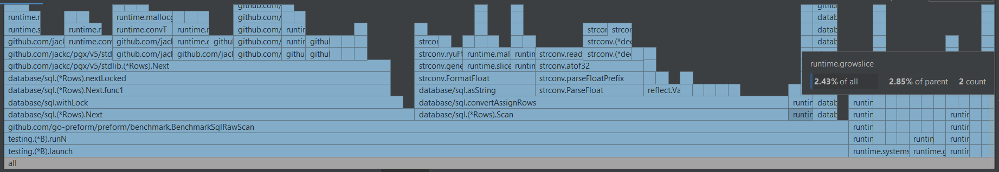
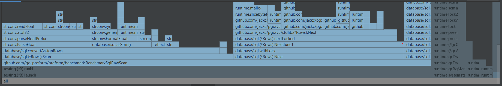
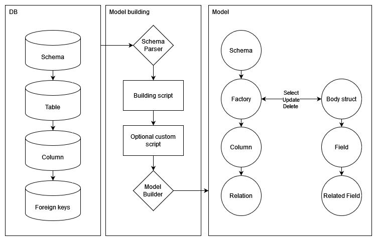
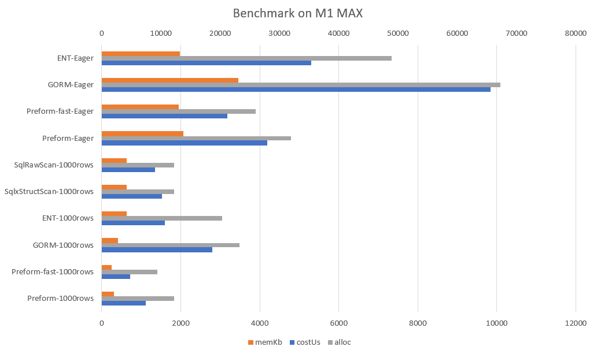

# How I made an ORM faster than raw SQL scan?

## Introduction:

When considering data storage solutions, SQL remains a preferred option for most backend developers. Approximately 80% of Golang services rely on SQL to varying degrees. Developers constantly seek to optimize performance, often resorting to hard-coding queries and data scanning loops for efficiency.

```go
var (
    testAs []preformModel.TestABody
    testA  preformModel.TestABody
)

rows, err = sqlxConn.Query("SELECT id, \"name\", \"int4\", \"int8\", \"float4\", \"float8\", \"bool\", \"text\", \"time\" FROM test_a limit 1000;")
if err != nil {
	b.Error(err)
}
for rows.Next() {
	err = rows.Scan(&testA.Id, &testA.Name, &testA.Int4, &testA.Int8, &testA.Float4, &testA.Float8, &testA.Bool, &testA.Text, &testA.Time)
	if err != nil {
		b.Error(err)
	}
	testAs = append(testAs, testA)
}
```
While this approach boosts performance, it lacks flexibility for implementing additional features such as filtering or dynamic column lookups. To address these limitations, developers often turn to Object-Relational Mapping (ORM) tools. However, ORMs typically sacrifice some performance (between 5-30%) in favor of convenience, a compromise that may not be acceptable in performance-sensitive scenarios.

## The Challenge:

Is it possible to achieve the performance benefits of hard-coding while retaining the conveniences of an ORM? Let's explore potential solutions to this challenge.

## optimize the loop

When looking at the flame graph we can observe which part cost the most.




Before we go deeper, the growslice() stood out. Yes because whenever we append an element into the result slice, it may trigger growslice() and that’s expensive! How could we avoid that?

```go
var testAs = make([]preformModel.TestABody, 0, cap)
```

Setting the capacity can surely avoid the rapid use of growslice(). However, it requires us to know the maximum length of the result before calling rows.Next() and it’s impossible… but wait maybe we can!

```go
var (
    limit = 1000
    testAs = make([]preformModel.TestABody, 0, limit)
    testA  preformModel.TestABody
)

rows, err = sqlxConn.Query(fmt.Sprintf("SELECT id, \"name\", \"int4\", \"int8\", \"float4\", \"float8\", \"bool\", \"text\", \"time\" FROM test_a limit %d;", limit))
```

Great, growslice() is gone! It doesn’t just reduce some CPU costs but also saves us a considerable amount of memory and alloc. Less memory means less heap application to OS and fewer GC+STW, which is critical for real-time systems.

```bash
#before
BenchmarkSqlRawScan-20               471           2518577 ns/op          650847 B/op      12181 allocs/op
#after
BenchmarkSqlRawScan-20               502           2413034 ns/op          308201 B/op      12170 allocs/op
```

Another finding from the graph is the gap between the cost of the benchmark runner and the cost sum of all its children. After some experiments, I found they are mostly coming from the pointer taking action of the rows.Scan() parameters. They look unavoidable but actually, we can just do it once!

```go 
var ptrs   = []any{&testA.Id, &testA.Name, &testA.Int4, &testA.Int8, &testA.Float4, &testA.Float8, &testA.Bool, &testA.Text, &testA.Time}
...
for rows.Next() {
    err = rows.Scan(ptrs...)
	...
    testAs = append(testAs, testA)
}
```

It requires a relatively deep understanding of how struct and slice append work. In short:
1. Taking pointers from the result struct so rows.Scan() will set values into that struct.
2. Append struct into slice will clone a new identical struct into the tail
3. Reuse the pointers and struct from 1 & 2 and repeat until EOF



The graph aligned! The scanning loop is almost perfect now.

## Improving Query Builder

Before building an ORM, we have to think of how we arrange our SQL queries. A query builder is an ideal tool for that.

I love the syntax of [Masterminds/squirrel](https://github.com/Masterminds/squirrel), it looks like raw SQL but yet flexible and extendable. But when it comes to performance isn’t that great. The query builder itself uses a map to contain the input parameters before calling ToSql() which is flexible but relatively slow.

```go
type SelectBuilder builder.Builder

type Builder struct {
	builderMap ps.Map
}

func (b SelectBuilder) From(from string) SelectBuilder {
    return builder.Set(b, "From", newPart(from)).(SelectBuilder)
}
```

After finishing the query config and calling the ToSql(), the parameters will pass to a struct and start building the actual query string and arguments.

So not much to think about, we will just take away the expensive map and let the configurations directly go to the struct. Thanks to the author there is great test coverage so I could dare to make such big changes without much concern.

```bash
BenchmarkSelect-20                 36884             32769 ns/op           20546 B/op        424 allocs/op
BenchmarkSelectFast-20            110514             11063 ns/op            9288 B/op        186 allocs/op
```

Almost 200% faster!

Another big cost I found later is the argument [placeholder replacing function](https://github.com/Masterminds/squirrel/blob/master/placeholder.go#L88). It uses buff and strings.Index() which should be highly efficient. But in such a scenario, we have a better and simpler choice: strings.Split(). The only difficulty is to escape the “??” to “?”.

```go
func replacePositionalPlaceholdersFast(sql, prefix string) (string, error) {
	var (
		parts = strings.Split(sql, "?")
		l     = len(parts)
		j     = 0
	)
	if l == 1 {
		return sql, nil
	}
	for i := 1; i < l; i++ {
		if parts[i] != "" {
			if parts[i-1] != "" {
				parts[i] = prefix + strconv.Itoa(j+1) + parts[i]
				j++
			} else {
				parts[i] = "?" + parts[i]
			}
		} else if i == l-1 {
			if parts[i-1] == "" {
				parts[i] = "?"
			} else {
				parts[i] = prefix + strconv.Itoa(j+1)
			}
		}
	}
	return strings.Join(parts, ""), nil
}
```

```bash
BenchmarkReplacePositionalPlaceholders-20                 120510              9213 ns/op            4884 B/op        105 allocs/op
BenchmarkReplacePositionalPlaceholdersFast-20             272564              4123 ns/op            2965 B/op        104 allocs/op
```

Another 100%!

## Delving into Golang SQL Libraries

After these, my abstracted code has already achieved little performance gains over ordinary handwriting reading loops. But I won’t stop here!

In the flame graph, we see there are two big items, rows.Next() and rows.Scan(). I think we can’t do much on the rows.Next(). Therefore I focus on studying the rows.Scan() source code. And easily found that the evil is [convertAssignRows()](https://github.com/golang/go/blob/master/src/database/sql/convert.go#L219).

That’s a huge function with lots of resource foodies: reflect, type checking/casting/assertion. The only hope of escaping from that is sql.Scanner interface. It provides a chance for us to bypass most of the evils. Say, if we know that scanning position must provide int value and we directly put it into our struct. As a result, we can avoid most of the reflect functions.

```go
type Int32 struct {
	Value    *int
}

func (s *Int32) Scan(src any) (err error) {
	switch src.(type) {
	case int64:
		*s.Value = int32(src.(int64))
	case int32:
		*s.Value = src.(int32)
	case int:
		*s.Value = int32(src.(int))
	}
	return err
}

var (
	scanner = &Int{&testA.Int4}
)
...
for rows.Next() {
    err = rows.Scan(scanner)
    ...
}
```

```bash
# without scanner
BenchmarkPreformSelectAll-20               1107    1114150 ns/op   313897 B/op    12231 allocs/op #1000 rows
# with scanner
BenchmarkPreformSelectAllFast-20           1598     718653 ns/op   260551 B/op     9337 allocs/op #1000 rows
# raw scan
BenchmarkSqlRawScan-20                      874    1350841 ns/op   650702 B/op    12180 allocs/op #1000 rows
```

That's significant!

## Conclusion

At last, [PREFORM](https://github.com/go-preform/preform) fixed the dilemma of performance and abstraction. The model builder reads the schema and generates data models, providing a performance boost from the above hacks. And it also generates factories, which can be helpful in building queries and manipulate models.



```go
users, err := mainSchema.User.Select(mainSchema.User.Id, mainSchema.User.Username). // select columns with predefined column fields
    Where(mainSchema.User.Id.Eq(9527).And(mainSchema.User.Flags.Any(1))).          // condition without hand-writing string
    Eager(mainSchema.User.Orders.Columns(mainSchema.Order.Amount).                   // eager loading with options
        Eager(mainSchema.Order.Products)).                                           // multiple levels eager loading
    Ctx(ctx).GetAll()

cards, err := users[0].LoadCards()
```

Please share your thoughts or feedback on these. I would love to hear your opinions and suggestions.



```bash
# with local docker postgres, 1000 rows on Apple M1 MAX
goos: darwin
goarch: arm64
pkg: github.com/go-preform/preform/benchmark
BenchmarkPreformSelectAll-20               1107    1114150 ns/op   313897 B/op    12231 allocs/op #1000 rows
BenchmarkPreformSelectAllFast-20           1598     718653 ns/op   260551 B/op     9337 allocs/op #1000 rows
BenchmarkPreformSelectEager-20              327    4195277 ns/op  2111897 B/op    31951 allocs/op #100 rows + 1000 + 1000
BenchmarkPreformSelectEagerFast-20          385    3184728 ns/op  2001004 B/op    25971 allocs/op #100 rows + 1000 + 1000
BenchmarkGormSelectAll-20                   506    2805352 ns/op   416675 B/op    23210 allocs/op #1000 rows
BenchmarkGormSelectEager-20                 129    9838620 ns/op  3537747 B/op    67227 allocs/op #100 rows + 1000 + 1000
BenchmarkEntSelectAll-20                    721    1592649 ns/op   639373 B/op    20357 allocs/op #1000 rows
BenchmarkEntSelectEager-20                  267    5305585 ns/op  2025764 B/op    48888 allocs/op #100 rows + 1000 + 1000
BenchmarkSqlxStructScan-20                  814    1529897 ns/op   651149 B/op    12183 allocs/op #1000 rows
BenchmarkSqlRawScan-20                      874    1350841 ns/op   650702 B/op    12180 allocs/op #1000 rows
```

Thank you for reading.

## Credits

- [Masterminds/squirrel](http://github.com/Masterminds/squirrel)
- [vali637](https://github.com/vali637)
- [Eleron8](https://github.com/Eleron8)